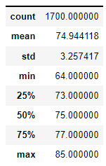
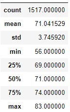

# Challenge 9 - Surf's Up
## Overview
The purpose of this analysis is to determine the key weather differences in Oahu, HI between the December and June months by summarizing weather data collected from stations on the island in those months. 
## Results
The temperature summary for June:



The temperature summary for December:



Three differences in the monthly data were noticed:

* The mean temperature in June is nearly **4 degrees** higher than in December
* The temperature in June varies a bit less, by 3.25 standard deviations, instead of 3.75 in December.
* The coldest temperature logged was **8 degrees** warmer in June, at 64°, compared to 56° in December.

## Summary

Based on the results collected, we recommend selecting **June** as the best month to open the surf shop. The weather is warmer on average, with fewer cold days, which will lead to more ice cream sales and surf rentals.

For further analysis, we could query the min, max, and average rainfall for the same two months, using the python `SQLAlchemy` query, where `MONTH_NUMBER` is the numeric number of the month:

``` PYTHON
session.query(func.min(Measurement.prcp), func.max(Measurement.prcp), func.avg(Measurement.prcp)).\
    filter(extract('month',Measurement.date) == {{MONTH_NUMBER}}).\
    all()
```

Additionally, we could pinpoint the **driest day in June**, on average by counting the number of zero-precipitation measurements across the island, and grouping by day. The following query will do that:

``` PYTHON
june_precip = session.query(Measurement.date,func.count(Measurement.id)).\
    filter(extract('month',Measurement.date) == '6').\
    filter(Measurement.prcp == '0').\
    group_by(extract('day',Measurement.date)).all()
```

Note that the date column in the above query shown will display full dates - pay attention to the day value only.
